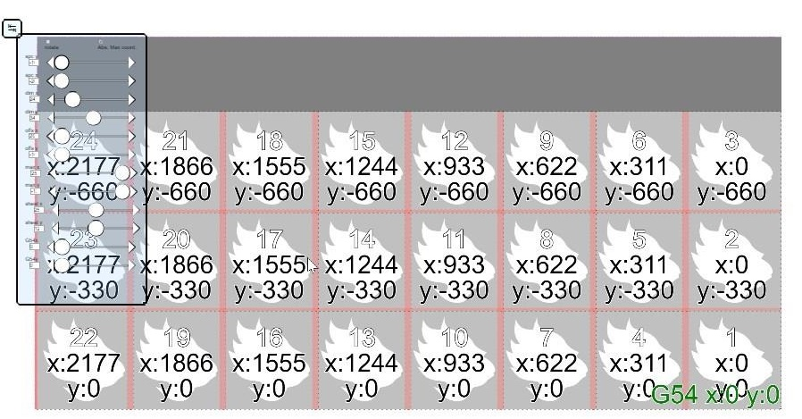
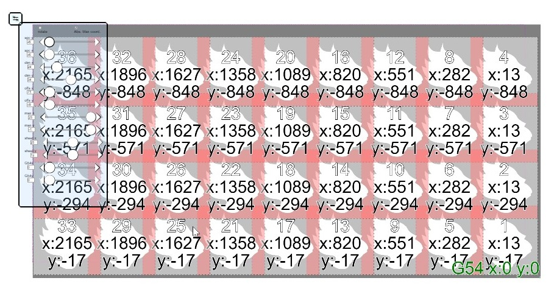
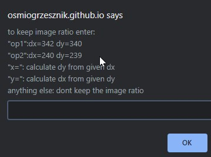

# BlankEZ
[working demo](https://osmiogrzesznik.github.io/BlankEZ/BlankEZ.html)

2d laser sheet blank cutting helper

Quickly check how many parts can be safely cut from sheet of given size.
Floating and draggable controls container allows live adjusting of parameters without obstructing the view.

App allows to enter size of cut blank , sheet,cuttin area , G54, and produces the image with subsequent cutting program coordinates, overlaps or overflows indicated in red
additionally you can import a photo of part, to help you maximize efficiency and minimize material waste

